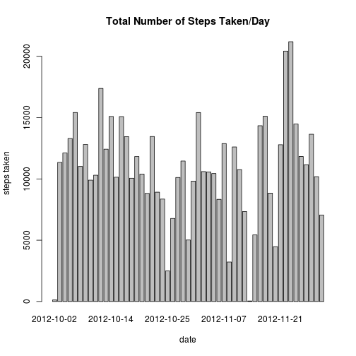
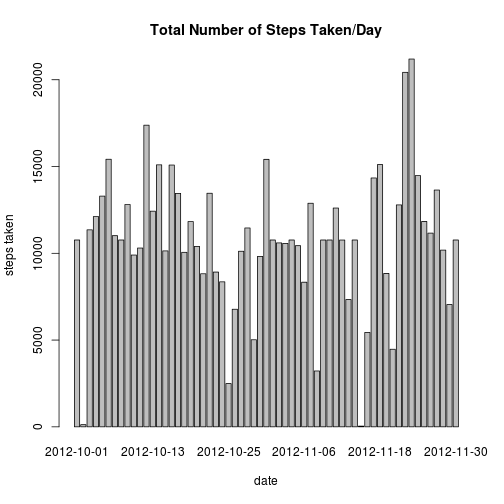

# Reproducible Research: Peer Assessment 1

This assignment makes use of data from a personal activity monitoring device. This device collects data at 5 minute intervals through out the day. The data consists of two months of data from an anonymous individual collected during the months of October and November, 2012 and include the number of steps taken in 5 minute intervals each day.

## Loading and preprocessing the data


```r
load_data_set <- function() {
    dataSetArchiveName = "activity.zip"
    dataSetExtractedName = "activity.csv"
    dataSetArchiveUrl = "https://d396qusza40orc.cloudfront.net/repdata%2Fdata%2Factivity.zip"
    if (!file.exists(dataSetArchiveName)) {
        download.file(dataSetArchiveUrl, destfile = dataSetArchiveName, method = "curl")
        unzip(dataSetArchiveName)
        dateDownloaded <<- date()
    } else {
        if (!file.exists(dataSetExtractedName)) {
            unzip(dataSetArchiveName)
        }
    }
    dataSet <- read.csv(dataSetExtractedName, header = TRUE)
    dataSet$steps <- as.numeric(dataSet$steps)
    dataSet$date <- as.Date(dataSet$date, format = "%Y-%m-%d")
    dataSet
}
data <- load_data_set()
```


### Quick examination of the data

```r
summary(data)
```

```
##      steps            date               interval   
##  Min.   :  0.0   Min.   :2012-10-01   Min.   :   0  
##  1st Qu.:  0.0   1st Qu.:2012-10-16   1st Qu.: 589  
##  Median :  0.0   Median :2012-10-31   Median :1178  
##  Mean   : 37.4   Mean   :2012-10-31   Mean   :1178  
##  3rd Qu.: 12.0   3rd Qu.:2012-11-15   3rd Qu.:1766  
##  Max.   :806.0   Max.   :2012-11-30   Max.   :2355  
##  NA's   :2304
```

```r
str(data)
```

```
## 'data.frame':	17568 obs. of  3 variables:
##  $ steps   : num  NA NA NA NA NA NA NA NA NA NA ...
##  $ date    : Date, format: "2012-10-01" "2012-10-01" ...
##  $ interval: int  0 5 10 15 20 25 30 35 40 45 ...
```


## What is mean total number of steps taken per day?

### Make a histogram of the total number of steps taken each day


```r
library(plyr)
steps_per_day <- ddply(data, .(date), summarize, sum = sum(steps))
steps_per_day <- steps_per_day[complete.cases(steps_per_day$date, steps_per_day$sum), 
    ]
barplot(steps_per_day$sum, names.arg = steps_per_day$date, main = "Total Number of Steps Taken/Day", 
    xlab = "date", ylab = "steps taken")
```

 


### Calculate and report the *mean* and *median* total number of steps taken per day


```r
mean(steps_per_day$sum)
```

```
## [1] 10766
```

```r
median(steps_per_day$sum)
```

```
## [1] 10765
```


## What is the average daily activity pattern?

### Make a time series plot (i.e. type = "l") of the 5-minute interval (x-axis) and the average number of steps taken, averaged across all days (y-axis)


```r
steps_per_interval <- aggregate(steps ~ interval, data, FUN = mean)
plot(steps_per_interval, type = "l", main = "Average Daily Activity Pattern")
```

 


### Which 5-minute interval, on average across all the days in the dataset, contains the maximum number of steps?


```r
max_number_of_steps <- steps_per_interval$interval[which.max(steps_per_interval$steps)]
max_number_of_steps
```

```
## [1] 835
```


Interval **835** contains the maximum number of steps.

## Imputing missing values

### Calculate and report the total number of missing values in the dataset (i.e. the total number of rows with NAs)


```r
sum(is.na(data))
```

```
## [1] 2304
```


### Devise a strategy for filling in all of the missing values in the dataset. The strategy does not need to be sophisticated. For example, you could use the mean/median for that day, or the mean for that 5-minute interval, etc.

To populate missing values, we will replace them with the mean value at the same interval across days.


```r
na_index <- which(is.na(data$steps))
no_missing_values <- data
for (i in na_index) {
    no_missing_values$steps[i] <- steps_per_interval[steps_per_interval$interval == 
        no_missing_values$interval[i], ][, 2]
}
```


A summary of the new data set with no missing values:


```r
summary(no_missing_values)
```

```
##      steps            date               interval   
##  Min.   :  0.0   Min.   :2012-10-01   Min.   :   0  
##  1st Qu.:  0.0   1st Qu.:2012-10-16   1st Qu.: 589  
##  Median :  0.0   Median :2012-10-31   Median :1178  
##  Mean   : 37.4   Mean   :2012-10-31   Mean   :1178  
##  3rd Qu.: 27.0   3rd Qu.:2012-11-15   3rd Qu.:1766  
##  Max.   :806.0   Max.   :2012-11-30   Max.   :2355
```


### Make a histogram of the total number of steps taken each day and Calculate and report the mean and median total number of steps taken per day.


```r
steps_per_day_no_missing_values <- ddply(no_missing_values, .(date), summarize, 
    sum = sum(steps))
barplot(steps_per_day_no_missing_values$sum, names.arg = steps_per_day_no_missing_values$date, 
    main = "Total Number of Steps Taken/Day", xlab = "date", ylab = "steps taken")
```

 

```r
mean(steps_per_day_no_missing_values$sum)
```

```
## [1] 10766
```

```r
median(steps_per_day_no_missing_values$sum)
```

```
## [1] 10766
```


### Do these values differ from the estimates from the first part of the assignment? What is the impact of imputing missing data on the estimates of the total daily number of steps?

Comparing with the calculations done in the first part of the assignment, we observe that while the mean value remains unchanghed, the median value has changed and is now closer to the mean.

## Are there differences in activity patterns between weekdays and weekends?

### Create a new factor variable in the dataset with two levels -- "weekday" and "weekend" indicating whether a given date is a weekday or weekend day.


```r
dayType <- function(day) {
    if (weekdays(day) %in% c("Saturday", "Sunday")) 
        "weekend" else "weekday"
}
data$dayType <- as.factor(sapply(data$date, dayType))
```

### Make a panel plot containing a time series plot (i.e. type = "l") of the 5-minute interval (x-axis) and the average number of steps taken, averaged across all weekday days or weekend days (y-axis).


```r
par(mfrow = c(2, 1))
weekday <- aggregate(steps ~ interval, data, subset = data$dayType == "weekday", 
    FUN = mean)
weekend <- aggregate(steps ~ interval, data, subset = data$dayType == "weekend", 
    FUN = mean)
plot(weekday, type = "l", main = "weekday")
plot(weekend, type = "l", main = "weekend")
```

 

